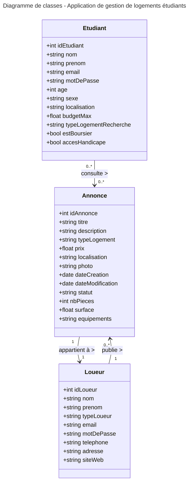

```mermaid
---
title: Diagramme de classes - Application de gestion de logements étudiants
---
classDiagram

%% ==== CLASSES ====

class Etudiant {
    +int idEtudiant
    +string nom
    +string prenom
    +string email
    +string motDePasse
    +int age
    +string sexe
    +string localisation
    +float budgetMax
    +string typeLogementRecherche
    +bool estBoursier
    +bool accesHandicape
}

class Loueur {
    +int idLoueur
    +string nom
    +string prenom
    +string typeLoueur
    +string email
    +string motDePasse
    +string telephone
    +string adresse
    +string siteWeb
}

class Annonce {
    +int idAnnonce
    +string titre
    +string description
    +string typeLogement
    +float prix
    +string localisation
    +string photo
    +date dateCreation
    +date dateModification
    +string statut
    +int nbPieces
    +float surface
    +string equipements
}

%% ==== RELATIONS ====

Loueur "1" --> "0..*" Annonce : publie >
Annonce "1" --> "1" Loueur : appartient à >
Etudiant "0..*" --> "0..*" Annonce : consulte >


```